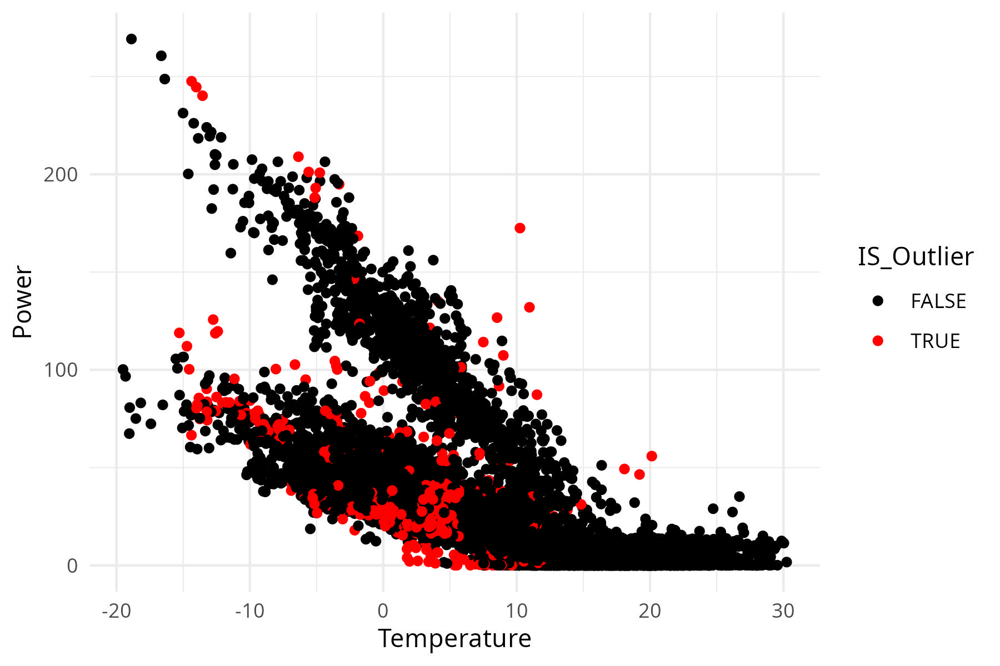

# Building_Heat_Load_Clustering_Profiling

Side project by Roberto GARAY-MARTINEZ. <https://github.com/robgaray/>, <https://robertogaray.com/>

This project takes building heat load and meteorological data and performs heat load modeling based only on this data.

Changepoint models are used to model heat loads [[2]](https://doi.org/10.1016/j.energy.2021.122318). These models are used in different ways:

-   These models are used to identify outliers. Observations with large deviations from the model (large residuals) are assumed to be outliers and removed from the dataset. Then an interpolation model is used to repair the dataset [[4]](https://doi.org/10.1016/j.procs.2024.09.646).

-   These models are used to model building energy performance.

As building energy performance is known to vary due to usage patterns, two different approaches are used:

-   Consider a Time of the Week (ToW) pattern, and develop a specific changepoint model for each hour in the week.

-   Analyze intra day load patterns and clusterize these patterns in a few "typical days". Then develop a changepoint model for each our in each of the typical days [[3]](https://doi.org/10.1016/j.jobe.2022.105732).

The attribution of a specific changepoint model to a specific observation is performed as follows:

-   For ToW patterns, the specific changepoint model to be used is defined based on the Time of the week.

-   For the "typical days" approach, a Classification And Regression Tree (CART) is used to attribute a specific pattern to a specific day. Then the changepoint corresponding to a specific hour within that day is used [[3]](https://doi.org/10.1016/j.jobe.2022.105732).

Model quality metrics are defined for three cases:

-   ToW models

-   "Typical day" approach, assuming that the attribution of a day to a typical pattern is done without errors.

-   "Typical day" approach, using the nice, but imperfect CART model.

# Repository structure

main.r executes everything.

Outputs are written into /output/

(all the folders are self explanatory)

# Inspiration

Over the years, I have worked together with several colleagues and students in data-driven heat load characterization of buildings. With a variety of approaches and data sets.

Some time ago, I developed an initial repository where I tried to put some of this knowledge in a more coherent way [[9]](https://github.com/robgaray/Building_Heat_Load_Characterisation). Since then, we have progressed, with more works and new approaches.

Additionally, in the last years generative AI tools have appeared, so I wanted to test how easy/practical/...was to use these in a particular niche context suxh as research in Energy in Buildings.

The main novelty over the previous work is how I develop pattern identification and attribution processes to develop individual models for each day type. And the fact that I'm coding this repository with the help of AI.

Obviously, this could not have been possible without my discussions and works with (in chronological order) Beñat Arregi, Mikel Lumbreras, Antonio Garrido, Markel Eguizabal, Ivan Flores, Olaia Eguiarte, Alaeddine Hajri, Marie Parant, Juan Manuel Lopez Garde, Iñigo Lopez, Talha Siddique, Angelo Zarrela, Nicola Borgato... If I had to select the key people, Beñat and Mikel have been there since the beginning, but everyone has collaborated with its bit to shape my approach to heat load modeling. I have probably discussed these methods with several other researchers in the course of the last years, but I sincerely can not remember with whom. To all of you, thank you.

# Context evolution

The method proposed here takes its roots in methods such as PRISM (1970-80s)and ASHRAE changepoint (1990s). I initiated these kind of analysis around 2015. Most of the datasets I use now are less than 5 years old.

In this period of time, the available data has increased exponentially, both in terms of availability, resolution and reliability.

Changepoint/Energy Signature models are relatively simple models that are formulated with 2-3 equations and 3-5 parameters. In recent years, we have developed more complex approaches where such formulas/parameters are defined and fitted for each hour of the week (24x7=168). As a result, we are using in the range of 840 parameters (168x5). If we consider that building energy modeling is typically performed with one year of data (say 8760h), then there is a relevant risk of over-fitting.

Thus, we need to find ways to reduce the number of parameters. Day type identification can reduce the number of days to model from 7 to something in between 3-4, with a linear reduction in the number of parameters. This process is tested in this repository.

I'm also testing other processes, but this will be part of another work.

# Aproach & criteria

## Changepoint models

The basics approach of changepoint models is that building operations can be characterized in different regimes. Homogeneous behavior is attributed in each of these and the "changepoint" is defined by a threshold temperature.

-   Heating regimes: Heat load is linear to the difference between ambient and changepoint temperature.

-   No heating/cooling regimes: Heat load is constant

-   Cooling regimes: Cooling load is linear to the difference between ambient and changepoint temperature.

Depending on the number of specific regimes identified, 1 or 2 changepoints are defined.

Greater details on changepoint models: <https://hdl.handle.net/1969.1/2847>

## Hour of the week

The main issue on changepoint models is that they assume that loads depend only on outoor temperature. In agreement with this, usage patterns are disregarded, and models are suitable to assess bulk energy usage (i.e. monthly), and transient phenomena is filtered out.

Time of Week Temperature (ToWT) models have been used to incorporate variations of the energy performance due to usage patterns. These models are constructed including specific models foe each hour of the week (one energy signature for each hourly slot).

We used this approach when we developed our Q-T algorithm some time ago in [[2]](https://doi.org/10.1016/j.energy.2021.122318). Although it is not exactly a changepoint model (see below), the model is still an energy signature model. This approach worked nicely and allows us to improve the prediction capacity.

## Input variables and the concept of "Changepoint"

Models are typically built with outdoor temperature as the explainatory variable. With this approach, outdoor temperature can also be used de define the point where the operational regime changes.

In line with our previous works, we consider not only outdoor temperature, but also solar radiation as input variables. In this context, we can no longer use outdoor temperature as the only variable to define the point of change, because solar irradiation also has an impact.

In our approach, we use the load itself as a point of change. If the modeled load (in the area corresponding to heating regime) is below a threshold, we assume that we are in a constant load area.

## Outlier detection & Data imputation

Detection of outliers is a complex task. Particularly for those cases where intra-day, inter-day and seasonal patterns overlap. In this case,I use a model-based outlier detection process. A load model is calibrated and used to assess the residuals.

If the residuals are too large, that observation is categorized as an outlier. The concept of "too large" is arguable. In this case, I assume (and test) a normal distribution, and consider a large multiplier of the standard deviation. Anything out of that threshold is an outlier. This process is referenced in [[4]](https://doi.org/10.1016/j.procs.2024.09.646), and was already available in [[9]](https://github.com/robgaray/Building_Heat_Load_Characterisation).

Data imputation is performed to fill gaps with missing data and/or to replace outliers. I perform this with an interpolation approach as defined in [[4]](https://doi.org/10.1016/j.procs.2024.09.646), and already available in [[9]](https://github.com/robgaray/Building_Heat_Load_Characterisation).

## Clusterization and Cluster Attribution.

Normalized daily profiles are taken as vectors with 24 values. Then a clusterization process is performed where the minimum number of clusters and their profile is defined.

Considering that my aim is to use these models for prediction. It is important that each cluster can be attributed to a particular day without any knowledge from the heat loads in that day. This is developed with a Classification and Regression tree.

These processes are explained in [[3]](https://doi.org/10.1016/j.jobe.2022.105732).

# Overall outcome

The overall outcome is the following:

-   The script performs a nice identification of changepoint models (Actually Q-T models)

{width="200"}

-   These models are used to identify outliers and then data voids are filled

{width="200"}

{width="200"}

-   Patterns are identified and a CART algorithm is used to predict the profile corresponding to each day.

{width="200"}

{width="200"}

With regards to the model quality, there seems to be some room for improvement. It seems that ToW models are not well suited for too cold and summer conditions (and a few other items).

{width="200"}

Although I am not fully happy with this outcome. I decided to publish this script in its current state. I will try to improve the model and make a v2 of this repository (if I succeed).

# Notes on Generative AI tools

This project was developed through the last quarter of 2024. This was already 6-12 months inside the wave of generative AI tools. So I tried to use these a little bit in this project.

I tested commercial alternatives such as Gemini and ChatGPT in their free versions. As an amateur, I can not comment on the differences between them.

I found-out that these tools were a good companion but with some limitations. See my comments below:

What they did nicely:

-   Introduction to general ML programming. i.e. clustering processes.

-   Subsetting & Plotting

What I found-out:

-   Paid versions (time-limited trials) were far better than free versions. Particularly when working on progressive improvements of long chunks of code.

What they did not do properly (basically specific physics and mathematical modelling):

-   The formulation of changepoint models. I got 5-8 different versions of what a changepoint model is. Some of them were correct, but for other contexts, and I could not find any engineering meaning to about 50% of the proposed models. None of them was what I wanted.

-   The interpolation process. Again, I wanted to make a blend among various inter-weekly and intra-daily patterns. which is quite specific. And the AI was not able to help with that.

Luckily, I already had all this done in [[9]](https://github.com/robgaray/Building_Heat_Load_Characterisation).

Overall, I believe that AI tools are a substantial productivity booster, and can help you dive into unknown worlds (in my case, clustering), but can not replace expert knowledge (at least for the moment).

# Literature & Data Sources

## Papers

### Basic literature

1.  Beñat Arregi, Roberto Garay, Regression analysis of the energy consumption of tertiary buildings, CISBAT 2017, Lausanne, Switzerland. Energy Procedia, Volume 122, 2017, Pages 9-14, ISSN 1876-6102, [[https://doi.org/10.1016/j.egypro.2017.07.290]{.underline}](https://doi.org/10.1016/j.egypro.2017.07.290).

2.  Mikel Lumbreras, Roberto Garay-Martinez, Beñat Arregi, Koldobika Martin-Escudero, Gonzalo Diarce, Margus Raud, Indrek Hagu, Data driven model for heat load prediction in buildings connected to District Heating by using smart heat meters, Energy, 2022, [[https://doi.org/10.1016/j.energy.2021.122318]{.underline}](https://doi.org/10.1016/j.energy.2021.122318)

3.  Mikel Lumbreras, Gonzalo Diarce, Koldobika Martin, Roberto Garay-Martinez, Beñat Arregi, Unsupervised recognition and prediction of daily patterns in heating loads in buildings, Journal of Building Engineering, 2023, [[https://doi.org/10.1016/j.jobe.2022.105732]{.underline}](https://doi.org/10.1016/j.jobe.2022.105732)

4.  Roberto Garay-Martinez, Muhammad Talha Siddique, Juan Manuel Lopez-Garde, Model-based Outlier Detection in District Heating Systems, Procedia Computer Science, 246, 2024, <https://doi.org/10.1016/j.procs.2024.09.646>

### Newer methods

5.  Nicola Borgato, Sara Bordignon, Enrico Prataviera, Roberto Garay-Martinez, Angelo Zarrella, Enhanced methodology for disaggregating space heating and domestic hot water heat loads of buildings in district heating networks, Applied Thermal Engineering, 2025, <https://doi.org/10.1016/j.applthermaleng.2024.125296>
6.  Iñigo Lopez-Villamor, Olaia Eguiarte, Beñat Arregi, Roberto Garay-Martinez, Antonio Garrido-Marijuan, Time of the week AutoRegressive eXogenous (TOW-ARX) model to predict thermal consumption in a large commercial mall, Energy Conversion and Management: X, 2024, [[https://doi.org/10.1016/j.ecmx.2024.100777]{.underline}](https://doi.org/10.1016/j.ecmx.2024.100777)

## Seminars

7.  <https://github.com/robgaray/SMACCS_Building_Heat_Load_Analysis.git>
8.  <https://github.com/robgaray/EESIA_Analisis_Consumo_2021_Publico.git>

## Repositories

9.  Roberto Garay. Building Heat Load Characterisation. 2023.v1 <https://github.com/robgaray/Building_Heat_Load_Characterisation>

## Data

Heat load data provided by GREN TARTU.

Climate data is taken from a a publicly available source at the University of Tartu. <https://meteo.physic.ut.ee/>
